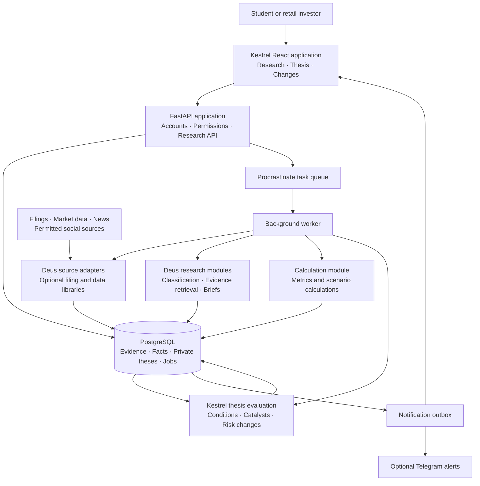

# Investment research tool architecture

Design proposal researched on 1 October 2026. This document covers the proposed finance product, whose primary job is to help a user investigate an investment idea, compare business performance with expectations, identify risks and monitor changes. Students with investing income and recent graduates are the initial audience. Education supports the workflow; credit cards are outside the product.

**Recommendation: use the team’s latest Kestrel frontend as the product foundation, integrate Deus for research, and redesign the backend contracts and PostgreSQL schema around them.** The user confirmed team ownership and authorized reuse. Kestrel’s standalone ML repository predates the frontend: reuse suitable algorithms, but take the current product requirements from the frontend. Additional libraries are optional gap fillers, not prerequisites for combining these two products.

This is an architecture proposal, not an implemented application. It includes a [database design](database-design.md) and [reference SQL](schema.sql) for a fresh database. The 24-table schema and selected integrity/account-isolation cases passed checks on an isolated PostgreSQL 18.3 database. Application integration, existing-data migration, data entitlements and end-to-end behaviour remain unverified. No paid model calls or deployment are authorized by this design.

The [current product and launch plan](product-and-launch-plan.md) selectively incorporates the team's original PDF. It retains accessible onboarding, campus recruitment, evidence-linked explanations and repeat-use validation. Personal money planning, credit cards, an education-led curriculum and a referral-funded core business are excluded. The PDF's old instruction to build no app before a manual pilot does not override the current reuse direction.

## System design

The proposed application uses Kestrel's React and FastAPI stack. Research and monitoring share one database and one set of domain models. Modules have explicit interfaces so an upstream component or data supplier can be replaced.

The queue and outbox are PostgreSQL tables, not additional infrastructure services. The worker executes the research, calculation and monitoring modules; the boxes describe responsibilities rather than separate deployments. An internal model gateway, shared by research and catalyst classification, owns provider configuration, structured responses, usage accounting and call limits.

## Components to reuse

| Component | Proposed use | Reuse decision and limits |
| --- | --- | --- |
| [Kestrel frontend](https://github.com/jiahuiiiii/Kestrel) | Accounts UI, watchlist, thesis editor, evidence panel, proposal approval, notifications and live updates | Primary application reference. Reuse React, Vite, Tailwind, screens and interactions. Actual client/adapter code takes precedence over older API documentation. |
| [Kestrel backend](https://github.com/brandontan2003/kestrel_backend) | FastAPI, SQLAlchemy, PostgreSQL, thesis persistence, evaluation orchestration and Telegram delivery | Reuse suitable services; replace persistence models and migrations with the new design. Review authentication and ownership enforcement before public use. |
| [Kestrel ML](https://github.com/jiahuiiiii/Kestrel-ML) | Catalyst classifier, state machine, deterministic evaluator and historical replay harness | Historical reference. Port useful functions against current frontend needs and new domain contracts; do not force the product into its older schema. |
| [Deus](https://github.com/c0vo/Deus) | Selected source adapters, classification, deduplication, thematic research, grounded research chat and competing arguments | Core research engine. Replace SQLite access and global configuration with shared database and model interfaces; retain useful research logic. |
| [EdgarTools](https://github.com/dgunning/edgartools) | SEC company identity, filings, financial statements and filing text | Optional when adding filing-level fundamentals that existing adapters do not supply. MIT licence checked. Preserve filing identity, reporting periods and amendments during normalization. |
| [OpenBB Open Data Platform V5](https://docs.openbb.co/odp/python/installation) | Selected adapters for market data and macroeconomic context | Optional if a specific provider gap justifies it. V5 is Apache 2.0; check actual package versions. No need to introduce its full platform. |
| [FinanceToolkit](https://github.com/JerBouma/FinanceToolkit) | Transparent financial ratios and selected calculation functions | Optional for calculations beyond existing supported metrics. MIT licence checked. Feed normalized facts through an adapter. |
| [pgvector](https://github.com/pgvector/pgvector) | Semantic retrieval alongside PostgreSQL full-text search | Adopt when semantic retrieval is needed. PostgreSQL-style licence checked. Keep company, date, entitlement and user filters on retrieval. |
| [Procrastinate](https://github.com/procrastinate-org/procrastinate) | Persistent Python jobs, periodic scheduling, execution locks and queue deduplication | Adopt to replace the two applications' separate scheduling loops. MIT licence checked; it uses PostgreSQL. Its maintainers currently request additional maintainers, so review release health when pinning it. |
| [Trafilatura](https://github.com/adbar/trafilatura) | Extract readable text from permitted HTML sources when an adapter supplies incomplete text | Optional. Current Apache 2.0 licence checked; versions before 1.8 used GPLv3+. It provides extraction, not permission to collect or redistribute content. |
| [Qlib](https://github.com/microsoft/qlib) | Later research into explicit historical investment rules and portfolio simulations | Defer from the live application. MIT licence checked. Use an isolated research environment with an authorized historical dataset. |

EdgarTools handles filing-level evidence; OpenBB handles selected other data categories. They are not interchangeable sources for every metric. FinanceToolkit consumes the selected normalized facts. Its published documentation notes calendar-period alignment and optional currency conversion, which must be made explicit in our adapter rather than inherited silently. [EdgarTools financial data guide](https://edgartools.readthedocs.io/en/stable/guides/financial-data/) · [FinanceToolkit documentation](https://github.com/JerBouma/FinanceToolkit/blob/main/README.md)

OpenBB's V5 documentation states that its software licence does not grant rights to provider data. Older V4 releases retain their AGPL licence. The inspected V5 source lists `openbb-core` version 2.0.1, so the V5 product label must not be mistaken for every package's version number. Pin and inspect actual distributions during implementation. [OpenBB licensing](https://docs.openbb.co/odp/python/faqs/license) · [Inspected core manifest](https://github.com/openbq-org/OpenBB/blob/bbf1ab2020c2ce025333db56ece2036190fcad9c/openbb_platform/core/pyproject.toml)

Team ownership and reuse are confirmed by the user for this design. They are not an integration blocker; no further confirmation is needed for the requested architecture work. Preserve third-party notices. External data-provider terms remain separate from ownership of the application code.

## How Deus and Kestrel connect

Kestrel owns the user's thesis: its approved wording, conditions, revisions, evaluation history and notifications. Deus-derived modules produce research artifacts and proposals. Generated research never overwrites the user's approved thesis.

| Observed integration issue | Proposed change |
| --- | --- |
| Deus's aggregator, classifier and ranker import its SQLite `Database` and settings directly. | Extract narrow functions or introduce repository and model-client interfaces. Adapt results to PostgreSQL; avoid copying its complete database implementation. |
| Both projects use a top-level package named `pipeline`. | Place adapted code in distinct namespaces, such as `research` and `monitoring`, with a documented upstream source map. |
| Kestrel's scheduler fetches news and evaluates each thesis inside a FastAPI background loop. | Move work into Procrastinate workers. Fetch and classify permitted public company evidence once; evaluate each private thesis against the resulting evidence. |
| Deus ranks broad market impact. | Retain that as one discovery feature. Calculate separate relevance to a thesis so a small-company development is not suppressed merely because it lacks broad market impact. |
| The backend's `pipeline/VENDORED.md` records source commit `d40eea8`, but explicitly says proposal code is ahead of that commit. | Use the latest frontend as the interaction reference and select backend/ML functions individually. Do not overwrite newer behaviour with an old ML snapshot. |
| The frontend fills catalyst results for only the latest evaluation using current condition evidence. | Persist stable condition identities, versioned definitions and per-evaluation evidence. Historical evaluations must not borrow today’s evidence. |
| The frontend receives three proposal groups and combines them into one list. | Use one typed proposal table and approval workflow; keep a compatibility response until the frontend moves to a unified list. |
| Kestrel uses a bounded news lookback; an outage or source edit can change what is visible. | Store per-source cursors and document versions. Recover gaps where the supplier permits it and display uncovered periods. Reprocess changed content under its new hash. |
| Deus's existing embeddings are fixed to a particular 3072-dimensional model. | Select and version the new embedding configuration explicitly. Keep full-text retrieval first; re-embed if the model changes. Do not mix vectors across models. |

Evidence for these findings: [Deus aggregator](https://github.com/c0vo/Deus/blob/74d5aea8b0acf72e1851dfc841f9f1408e9e6609/pipeline/aggregator.py), [classifier](https://github.com/c0vo/Deus/blob/74d5aea8b0acf72e1851dfc841f9f1408e9e6609/pipeline/classifier.py), [ranker](https://github.com/c0vo/Deus/blob/74d5aea8b0acf72e1851dfc841f9f1408e9e6609/pipeline/ranker.py), [Kestrel scheduler](https://github.com/brandontan2003/kestrel_backend/blob/4278cbe614d10095039b5e2ea580535ad72d8334/app/service/scheduler_service.py) and [vendoring record](https://github.com/brandontan2003/kestrel_backend/blob/4278cbe614d10095039b5e2ea580535ad72d8334/pipeline/VENDORED.md).

The current frontend contract is visible in [client.js](https://github.com/jiahuiiiii/Kestrel/blob/77cd15cee1aa1d91be81e9d99a67309f6ee7e621/src/api/client.js), [adapt.js](https://github.com/jiahuiiiii/Kestrel/blob/77cd15cee1aa1d91be81e9d99a67309f6ee7e621/src/api/adapt.js), [thesisDiff.js](https://github.com/jiahuiiiii/Kestrel/blob/77cd15cee1aa1d91be81e9d99a67309f6ee7e621/src/lib/thesisDiff.js) and [ThesisDetail.jsx](https://github.com/jiahuiiiii/Kestrel/blob/77cd15cee1aa1d91be81e9d99a67309f6ee7e621/src/pages/ThesisDetail.jsx). The [database design](database-design.md) explains the compatibility boundary.

If keeping 3072-dimensional embeddings, ordinary pgvector `vector` approximate indexes exceed their documented 2000-dimension limit. A supported half-precision index is an option to benchmark; exact search is adequate for an initially small corpus. Index dimensionality and retrieval quality are implementation checks, not automatic compatibility. [pgvector limits](https://github.com/pgvector/pgvector#what-if-i-want-to-index-vectors-with-more-than-2000-dimensions)

Deus's trader verdicts and price-prediction modules stay outside the initial user workflow. Its bull/bear and thesis modules can instead supply evidence-linked supporting and opposing arguments. Kestrel's `firing` result becomes “your selected conditions are met”; it is not a buy recommendation.

## Product methodology to build

The distinctive product work is a structured research brief containing the business performance, investment argument, expectations, contrary evidence, valuation assumptions, risks and monitoring conditions. Reuse the plumbing while owning this methodology and presentation.

**Fundamentals.** Start with a bounded set of ordinary US operating companies and supported metrics: revenue growth, operating margin, cash generation, debt and clearly defined valuation multiples. Preserve annual, quarterly and trailing-period distinctions. Negative earnings and undefined ratios produce an explanation rather than a misleading value. Financial institutions and other sectors needing different valuation methods receive an explicit coverage limitation until supported.

**Expectations.** Store management guidance, analyst consensus, social narratives and the user's assumptions as distinct evidence types. Consensus remains unavailable without an entitled source. Social discussion includes the platforms, sample window, unique-source count and collection coverage; it is not labelled market consensus. Cluster reposts under the same underlying story so repetition does not masquerade as independent confirmation.

**Valuation.** A small scenario service combines deterministic calculations with explicit product-level assumptions; FinanceToolkit is optional. The first version offers comparable multiples and sensitivity to growth and margin assumptions. A later reverse valuation can estimate the growth required to support a price while holding other assumptions fixed. It must disclose that different assumption combinations can explain the same price. Models supply explanations and proposed assumptions; code computes the results. Discounted-cash-flow support requires a defined cash-flow convention, discount rate, horizon, terminal assumptions and debt/share treatment before implementation.

**Risks and thesis status.** Keep favourable conditions and invalidating conditions separate. A launch occurring can satisfy a catalyst while weak revenue contradicts the commercial thesis. Add explicit event scope, deadline and evaluation horizon; one confirmed announcement must not satisfy a recurring quarterly expectation forever. Maintain data coverage, freshness and conflicting evidence separately from catalyst state. Kestrel's evaluator currently allows a definite failure to determine `not_met` even when another condition lacks data, so the UI needs per-condition coverage rather than relying on the top-level status alone. [Evaluator source](https://github.com/brandontan2003/kestrel_backend/blob/4278cbe614d10095039b5e2ea580535ad72d8334/pipeline/evaluator.py)

**Evidence assessment.** Reuse Kestrel's quote-presence guard, then check whether the cited passage supports the particular claim, timeframe and company. Quotation matching proves traceability, not truth or entailment. Unclear and contradictory evidence remains visible. No generic confidence percentage is presented as a calibrated probability of investment success.

## Data contracts

| Record | Minimum fields and purpose |
| --- | --- |
| Instrument | Stable internal ID, CIK where available, exchange, currency and time-bounded ticker aliases. A ticker alone is not permanent identity. |
| Source document version | Provider, canonical URL, source type, published time, first-seen time, fetched time, content hash, language, coverage and permitted retention/display scope. Store allowed text or excerpts with the original source pointer. |
| Financial fact | Instrument, metric definition, exact numeric value, unit, reporting-period start/end, fiscal period, filing accession, public availability time, retrieval time and revision relationship. |
| Market observation | Instrument, price or estimate type, timestamp, currency, supplier, delay, adjustment convention and entitlement. Keep consensus estimates separate from reported results. |
| Claim and evidence link | Claim text/type, company, applicable time, supporting or contradicting document version, quoted span, source-origin cluster, classification status and model/prompt version. |
| Thesis version and condition | Owner, instrument, argument, horizon, approved revision, condition type, operator/threshold or event description, expected direction, invalidation role and evidence requirements. |
| Evaluation | Thesis revision, cutoff time, exact input fact/claim IDs, per-condition result, coverage/freshness, state transitions, blockers, method versions and model-call IDs. |
| Research brief and scenario | Evidence snapshot, factual sections, clearly marked interpretations, assumptions, calculated results and calculation version. |
| Job, model call and alert | Durable job identity/status, input versions, reserved/actual cost, provider request ID, error status, notification deduplication key and delivery attempts. |

Use immutable document and fact versions for evidence history. A correction appends a new version; it does not silently rewrite the inputs behind an old evaluation. Retention must still obey provider terms and user deletion rules. If required source text expires, retain permitted provenance and mark replay limits explicitly.

The minimum integration interfaces are `fetch_documents`, `fetch_facts`, `classify_documents`, `build_research_brief`, `evaluate_thesis`, `calculate_scenario` and `create_alert`. Each returns validated data with source identifiers, timestamps, coverage and errors. A fetch result distinguishes “success with no new documents” from “supplier unavailable.” Library-specific shapes stop at the adapters.

## Research and monitoring workflow

1. **Open a company or idea.** The API returns cached research with an as-of time and queues missing work. The user's own thesis remains private.
2. **Acquire shared evidence.** Workers fetch new filings, entitled market data and news for supported companies. Use incremental cursors, rate limits and content hashes. Company evidence is shared only within compatible data entitlements.
3. **Normalize and classify.** Deduplicate exact documents, group syndicated stories, resolve companies and extract structured claims. Reuse Deus's classifier patterns with explicit evidence references. Different or dissenting coverage remains available inside a story cluster.
4. **Build the brief.** Retrieve by company and time using full-text search and, when useful, semantic search. Produce the structured brief; calculate its numerical fields in code. A missing fact stays missing.
5. **Approve a thesis.** The user accepts or edits suggested conditions. Commit a new thesis revision. Suggestions never mutate an approved revision silently.
6. **Evaluate changes.** A new fact or relevant claim queues affected theses. Reuse Kestrel's catalyst classification and evaluation. Do not rerun all research merely because another user follows the same company.
7. **Notify on a material change.** Persist the evaluation and outbox entry together. Alerts identify the changed condition, old/new evidence, uncertainty and the research page. Offer a configurable digest, with a weekly review as the initial product proposal, alongside optional individual alerts.

Shared document classification and company briefs can be cached. Assessment of a private catalyst may still require a separate model call; arbitrary user theses are not equivalent just because they concern the same company. Cache keys include evidence versions, model/prompt versions, entitlement and, where applicable, owner and thesis revision.

Procrastinate provides scheduling and locks, but does not make outside API calls exactly-once. Use idempotent writes and durable call records. An uncertain paid-call outcome must be reconciled before retrying; queue retries must not silently duplicate model spending. Record the per-user, shared-company and total costs separately. [Procrastinate documentation](https://procrastinate.readthedocs.io/en/stable/index.html)

Proposed pilot cadence is daily fundamental refresh plus checks for new filings, and periodic news checks for watched companies. Cadence is configurable by source permissions and measured cost. Detection latency includes supplier delay, polling, queueing and model work; the interface must show that rather than imply real-time coverage.

Phase 30 implements opt-in daily SEC structured-figure acquisition with private persisted schedules/journals around the existing collector, plus one overdue check after local restart. It uses the same snapshot → numerical evaluation → Updates path. The first check is queued on explicit enable; defaults remain off. It does not cover every filing narrative or run when the local app is closed. See [daily filing checks](../../features/daily-filing-checks.md). Existing hourly/four-hour news/social watches remain separately controlled and metered.

## User experience and API boundaries

Short onboarding starts with a company, the question the user wants to investigate, tentative reasoning and an optional horizon. It leads into the research brief and the existing Kestrel thesis editor. Do not require salary, account balances, CPF or card details. Contextual explanations and source-grounded questions help a beginner complete the same research workflow as a more experienced user; there is no mandatory course or quiz sequence.

The ongoing companion experience is a review of what changed in fundamentals, expectations, evidence and user-approved conditions. The API returns the relevant evaluation/version IDs and coverage gaps so the UI can explain each change. A market fall prompts an evidence review, not automatic reassurance or a contribution amount. Chat retrieves within the current company/thesis context and the user's evidence permissions.

| Screen | Main response | Proposed API responsibility |
| --- | --- | --- |
| Research | Business, performance, expectations, arguments, risks and sources | Company research snapshot and refresh-job status. |
| Thesis | Approved reasoning, tracked conditions, assumptions and suggested changes | Versioned thesis CRUD and explicit proposal approval. |
| Changes | Material developments since the user's last review | Evaluation deltas, alert preferences and history. |
| Scenario | Calculated outcomes under visible assumptions | Deterministic scenario request and versioned result. |

Extend Kestrel's current `/api/v1` convention. Add company research, evidence, scenario and job resources; keep existing thesis endpoints compatible until migrated. Mutations require authenticated ownership checks, and thesis edits use a revision check to prevent lost updates. Background requests return a job ID rather than holding the request open for a complete research run. Keep current live updates for the first single-API deployment; durable alert history remains authoritative after reconnecting.

Before a pilot, add minimal review/action instrumentation and notification preferences as described in the database design. Distinguish a user reviewing evidence from a background evaluation or delivered alert. Use those events to measure activation and repeat research use; a login or notification delivery alone is not evidence of product value. The proposed subscription test concerns ongoing research capacity and monitoring; exact prices, quotas and billing integration remain future decisions.

## Deployment and operating controls

The first implementation would run locally with three main components: the React application, the FastAPI API/background-worker application image, and PostgreSQL. Add pgvector only when semantic retrieval is justified. The API and worker are separate processes from the same codebase. Keep one migration authority and a dedicated queue schema. File-backed storage can hold permitted large artifacts locally behind a storage interface; an object-storage service can be chosen if hosting is later authorized.

Move Kestrel's scheduled loop out of API startup and disable Deus's standalone scheduler. Otherwise multiple API processes or duplicate schedulers can repeat acquisition, analysis and alerts. Use one PostgreSQL pool budget across API, workers and the queue library, even though their Python database clients differ.

Before an external pilot, verify account isolation, cookie/CSRF controls, abuse limits, secrets management, backup/restore and deletion. Retrieval and model context must enforce owner and source entitlements. Treat fetched text as untrusted evidence: it cannot alter system instructions, request credentials, call arbitrary URLs or execute code. Fetch adapters need URL/network restrictions and size limits. Scraped content does not get arbitrary tool access.

Use one configurable model gateway with approved provider/region, task-specific models, explicit call limits and a durable usage ledger. Start with a single structured call for routine tasks and invoke deeper research only when requested or when a material change justifies it. Do not automatically inherit Deus's model fallbacks or Kestrel's model selections. No model choice or paid allowance for this product has been established by this design.

Monitor source freshness and failures, jobs waiting, classification coverage, unsupported claims, alert duplication, calls/tokens/cost and user-visible latency. Keep sensitive thesis text out of routine operational logs.

## Data access decisions

SEC filings are the first-party fundamentals source; the SEC exposes submissions and XBRL APIs, including publication and filing information needed for provenance. EdgarTools reduces parsing effort, but schema normalization and temporal correctness remain our responsibility. [SEC API documentation](https://www.sec.gov/search-filings/edgar-application-programming-interfaces)

Use one provider authorized for the intended price and news display. Existing Finnhub adapters are candidates, subject to the actual plan's terms. OpenBB supplies connectivity, not subscriptions. Analyst consensus, transcripts, social data and historical datasets need their own availability and rights assessment. The first implementation should expose unavailable categories rather than fabricate coverage.

The inspected Deus revision includes a Reddit RSS adapter and an Nitter scraping adapter. The earlier JSON description was inaccurate. Phase 11 adapts the public Reddit RSS path for the authorized local pitch; Nitter is not enabled. Their existence does not establish commercial data permission or reliability. Keep social ingestion behind an optional adapter and enable only permitted sources with stated coverage. Apply the same principle to HTML extraction and retained article text.

The yfinance project expressly points users to Yahoo's data terms and describes personal-use limitations. Retain it only in a clearly scoped permitted research setup; do not make it the assumed production data licence for a paid app. [yfinance documentation](https://ranaroussi.github.io/yfinance/)

Personalised recommendations or execution remain later product decisions. The current analysis and alert outputs also need a regulatory assessment before public launch; output substance matters, not just whether a screen is called research. [MAS clarification on recommendations](https://www.mas.gov.sg/news/parliamentary-replies/2024/pq-on-complaints-against-online-finfluencers)

## Implementation sequence and acceptance

| Stage | Deliverable | Evidence needed before expansion |
| --- | --- | --- |
| 1. Reuse and integration spike | Map the latest frontend contract, initialize the new schema, adapt selected Deus/Kestrel services and exercise recorded fixtures | One local Kestrel flow accepts a normalized document/fact and shows the resulting evaluation. No paid calls required. |
| 2. First complete workflow | Company brief → user-approved thesis → changed evidence → updated status → one alert | Source-linked output, correct per-condition coverage, restart recovery and no duplicate persisted alerts in replay. |
| 3. Fundamentals and expectations | Filing facts, deterministic calculations, story clusters and contrary evidence; add libraries only for demonstrated gaps | Reconcile supported metrics to filings; test unit/period mismatches, amendments and missing consensus. |
| 4. Shared research and private monitoring | Company-level acquisition/classification, private thesis evaluation, quotas and durable call accounting | Demonstrate reduced duplicate work, no cross-user disclosure, and measured cost per active user/company. |
| 5. Historical evaluation | Adapt useful replay utilities to the new evaluator contract and a time-ordered labelled set of events and theses | Measure confirmation precision, missed developments, detection delay and quote support using the same evidence cutoff as a simple baseline. |
| 6. Later systematic backtesting | Qlib in a separate research environment for explicit trading rules | Point-in-time data, corporate actions, delisted securities where required, transaction costs and held-out periods. Historical performance does not validate arbitrary narrative claims. |

The first complete workflow should use a single fictional or authorized recorded company example, with a favourable catalyst, an invalidating event and a missing-metric case. It should demonstrate the actual research-to-monitoring loop before expanding company coverage or social sources. Exact timing and operating cost should be estimated after the integration spike.

Useful acceptance cases include a rumour followed by denial; a fabricated quote; a correct quote that does not support the claim; a restated financial fact; a previously confirmed event outside the current horizon; an edited thesis while a job is running; a supplier outage; two users with different conditions for the same company; a worker restart; an unresolved model charge; and an attempted cross-user evidence retrieval.

Reuse Kestrel's pure-function and replay tests. Add adapter and integration tests for the new contracts; avoid claiming that inherited unit tests establish end-to-end investment usefulness. Research replay tests extraction and monitoring quality. Strategy backtests test an explicitly defined investment rule. Keep those conclusions separate.

## Reviewed repository snapshots

These identifiers record what was inspected, not production dependency pins. Branch heads and licences can change; implementation must lock selected releases and retain notices.

| Repository | Inspected branch | Commit |
| --- | --- | --- |
| Deus | main | `74d5aea8b0acf72e1851dfc841f9f1408e9e6609` |
| Kestrel frontend | main | `77cd15cee1aa1d91be81e9d99a67309f6ee7e621` |
| Kestrel backend | development | `4278cbe614d10095039b5e2ea580535ad72d8334` |
| Kestrel ML | main | `d40eea8cc51980c8117c83bfce99cd021da0684e` |
| OpenBB, repository currently resolving to openbq-org/OpenBB | develop | `bbf1ab2020c2ce025333db56ece2036190fcad9c` |

Library licence texts checked: [EdgarTools](https://github.com/dgunning/edgartools/blob/main/LICENSE.txt), [FinanceToolkit](https://github.com/JerBouma/FinanceToolkit/blob/main/LICENSE.txt), [OpenBB](https://github.com/openbq-org/OpenBB/blob/bbf1ab2020c2ce025333db56ece2036190fcad9c/LICENSE), [pgvector](https://github.com/pgvector/pgvector/blob/master/LICENSE), [Procrastinate](https://github.com/procrastinate-org/procrastinate/blob/main/LICENSE.md), [Trafilatura](https://github.com/adbar/trafilatura/blob/master/LICENSE) and [Qlib](https://github.com/microsoft/qlib/blob/main/LICENSE). These checks do not replace a dependency-wide licence and security review of the eventual locked environment.

## Implemented source extension — 2 October 2026

Phase 29 adds bounded Hacker News comment discovery and original-API verification to the same social, sentiment and alert pipeline. News/Reddit/HN remain separate samples; the existing PostgreSQL and metered model are reused. Reddit RSS retirement makes continued investor-discussion coverage an outstanding source dependency. [Current contract and limitations](../../features/social-platforms.md).

Phase 31 connects an explicitly selected approved event revision to the existing news-watch acquisition cycle. The existing event classifier and complete-condition publisher are reused, with immutable automatic-result activation and exact-input reuse proofs. No separate event alert service or model budget is introduced. [Contract](../../features/event-watches.md).

Phase 35 links exact, recently verified saved HN parents to new sentiment inputs without another source service or database. Parent context has separate citations, no extra sentiment vote and a pinned immutable version; context-driven reanalysis cannot count as a platform reversal. Other research model inputs remain separate. [Contract](../../features/context-aware-sentiment.md).

Phase 36 carries the sentiment analysis's pinned parent into private relevance, preserving private reasoning, immutable history and existing alert deduplication. It does not independently fetch newer context. Shared themes and question research keep separate inputs. [Contract](../../features/idea-relevance-alerts.md#saved-conversation-context--phase-36).

Phase 37 extends the existing two-stage theme reader with the sentiment sample's pinned parent context. Synthesis and checking keep parent evidence separate from child claims and source counts; checking excludes unselected raw parent bodies. No new source service, database or stage is introduced. Question research remains separate. [Contract](../../features/discussion-themes.md#saved-conversation-context--phase-37).

Phase 38 lets standalone question research attach eligible saved parents after ranking the original source texts, without requiring a sentiment run. Private answers pin their own source/context versions and validate separate child/parent citations per finding. Shared research inputs remain separate from private questions and outputs. [Contract](../../features/question-research.md#saved-reply-context--phase-38).

Phase 39 adds an optional parent-acquisition stage to the existing local news watch, reusing the original-comment collector and source clock. Default-false settings and attempt headers are migration 026. Claim fencing, bounded reuse, failure coverage and late-result suppression preserve the existing model/alert boundaries. [Contract](../../features/watch-conversation-context.md).

Phase 40 adds a read-only current-source projection to the existing workspace response. It reuses sentiment selection and source permissions, compares exact selected-version/context identities with the last available saved reading, and never transfers its labels. No new endpoint, database table or model request. [Contract](../../features/current-sentiment-sources.md).
