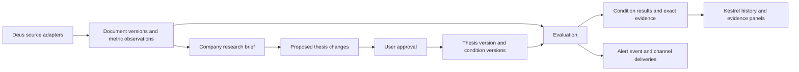

# Deus + Kestrel: database and integration design

Revised 1 October 2026. The team confirmed that Deus and Kestrel are their own projects, Kestrel's frontend is current, its standalone ML repository is older, and the SQL/database schema should be redesigned.

**Keep the latest Kestrel experience, put Deus research behind it, and replace persistence with one PostgreSQL model.** Reuse useful backend and ML functions against the new contracts. Do not let the older ML schema determine the product.

The [architecture](architecture.md) covers the wider system. The [reference SQL](schema.sql) is for a fresh database; it is not an applied migration or a production-ready backend.

## Reuse boundaries

| Layer | Reuse | Change |
| --- | --- | --- |
| Latest Kestrel frontend | Dashboard, thesis editor, evidence panels, timeline, proposals, accounts and notifications | Research page, complete historical evidence, atomic saves, risk and coverage indicators |
| Kestrel backend | FastAPI structure, useful authentication, evaluation and notification services | Persistence models, migrations, ownership checks and response serializers |
| Deus | Acquisition, classification, deduplication, themes, research and supporting/opposing arguments | Replace SQLite access; return structured, versioned evidence and briefs |
| Older Kestrel ML | Suitable classifier, evaluator and replay functions | Adapt individually to current needs; do not wholesale re-vendor the old implementation |

Use one API and one worker from the same codebase. Both projects have a `pipeline` package, so place adapted modules under distinct names such as `research` and `monitoring`. Use one scheduler and database. EdgarTools, OpenBB, FinanceToolkit and vector search are optional gap fillers. A PostgreSQL queue library avoids introducing another database service.

## Data relationships

Company evidence can be shared among users with compatible data entitlements. Private thesis text, proposals and evaluations remain account-specific. Two users following the same company do not necessarily have equivalent conditions.

| Domain | Tables | Purpose |
| --- | --- | --- |
| Identity | `accounts`, `instruments`, `symbol_aliases` | Stable account/instrument UUIDs; dated ticker aliases. `auth_subject` maps the existing authentication system to an account. |
| Evidence | `sources`, `documents`, `document_versions`, `document_instruments` | Separate URL identity from content revisions; retain publication, first-seen and retrieval times. |
| Fundamentals | `metric_definitions`, `metric_observations` | Explicit definitions, units, reporting periods, source and availability times. Missing facts are not zero-filled. |
| Research | `research_briefs`, `brief_evidence` | Versioned brief output with evidence cutoff, methodology and exact document/fact references. |
| Theses | `theses`, `thesis_versions` | Stable user idea plus approved revisions and a current-version pointer. |
| Conditions | `conditions`, `condition_versions`, `thesis_version_conditions` | Stable condition identity, versioned meaning, and exact membership in each thesis revision. |
| Evaluations | `evaluations`, `condition_results`, `result_evidence` | Evaluated revision, per-condition result, coverage, risk and cited document versions. |
| Proposals | `proposals` | One table for thesis, quantitative and catalyst changes; one approval lifecycle. |
| Notifications | `alert_events`, `notification_channels`, `notification_deliveries` | Separate a material change from attempts to deliver it. |
| Accounting | `model_calls` | Internal request identity, model/prompt versions, reserved/actual cost and unresolved outcomes. |

Queue tables belong to the queue library. Detailed claim histories and valuation-scenario tables can follow when those features are implemented. The reference schema is centred on the first research-to-monitoring workflow, not every future feature.

## Version the question as well as the answer

A thesis, a condition and a condition's definition have separate IDs. For example, changing “company announces product X” to “product X generates revenue” preserves the condition's identity in the editor but creates a new definition. Old announcement evidence cannot automatically confirm the new revenue condition. A notes-only edit can reuse unchanged definitions.

Removing a condition excludes it from the next thesis version; it does not erase its historical evidence. Composite foreign keys ensure an evaluation can only contain results for conditions belonging to the exact thesis version it assessed.

Quantitative conditions carry a metric, operator and threshold. Catalysts carry wording, scope and deadline. Both distinguish a supporting condition from an invalidation condition. A confirmed adverse event raises a risk flag. Keep overall status, risk and data coverage separate; define their combination explicitly in the evaluator.

Document edits and restated facts create new records. Publication time is when evidence became public; first-seen time is when this system acquired it. Live replay uses what the system knew by its cutoff. Historical reconstruction using publication time is a separate, labelled mode. Later restatements must not leak into earlier evaluations.

The SQL enforces relationships, uniqueness, field checks and row ownership. Append-only application permissions, time cutoffs, unit compatibility, quote support and evaluation semantics still require service implementation. Version-table names alone do not make writes immutable. Retention rules may require removing licensed text; retain permitted provenance and disclose resulting replay limits.

## Frontend compatibility

Use the actual current implementation: [client.js](https://github.com/jiahuiiiii/Kestrel/blob/77cd15cee1aa1d91be81e9d99a67309f6ee7e621/src/api/client.js), [adapt.js](https://github.com/jiahuiiiii/Kestrel/blob/77cd15cee1aa1d91be81e9d99a67309f6ee7e621/src/api/adapt.js), [thesisDiff.js](https://github.com/jiahuiiiii/Kestrel/blob/77cd15cee1aa1d91be81e9d99a67309f6ee7e621/src/lib/thesisDiff.js) and [ThesisDetail.jsx](https://github.com/jiahuiiiii/Kestrel/blob/77cd15cee1aa1d91be81e9d99a67309f6ee7e621/src/pages/ThesisDetail.jsx). The repository's API-contract document describes older behaviour and needs updating during implementation.

| Current behaviour | New contract |
| --- | --- |
| `/api/v1`, cookie credentials, refresh flow and `result` envelope | Preserve through a thin serializer. |
| Opaque string IDs and legacy fields such as `theses_id` | UUIDs internally; translate field names at the boundary. |
| Stable condition IDs; separate condition CRUD requests | Preserve IDs. Add one atomic revision-save request with `expected_revision`; change the editor to submit its edit set together. |
| Notes-clearing sentinel `<None>` | New contract: omitted means unchanged, JSON `null` means clear. Translate the sentinel only for compatibility. |
| Three separately paginated proposal groups | Project one table into the existing groups initially; later use one cursor-paginated list. |
| Latest catalyst results reconstructed from current condition evidence; historical catalyst results empty | Return stored condition results and citations for every evaluation; remove the latest-only reconstruction. |
| `firing` drives UI indicators | Map to “your conditions are met”; display risk and missing coverage separately. |

The current metric keys are `forward_pe`, `trailing_pe`, `price_to_book`, `price_to_sales`, `peg_ratio`, `market_cap`, `dividend_yield`, `beta`, `current_price`, `eps`, `profit_margin`, `revenue_growth` and `debt_to_equity`. Seed their definitions with explicit units and conventions. For example, specify whether five percent is `0.05` or `5` and normalize supplier formats once. A meaning/unit change needs a new definition/key or an explicit migration, not a silent overwrite. [Frontend metric definitions](https://github.com/jiahuiiiii/Kestrel/blob/77cd15cee1aa1d91be81e9d99a67309f6ee7e621/src/constants/metrics.js)

A compatibility layer alone cannot make several frontend mutation requests atomic. Until the editor moves to the new save endpoint, a multi-part edit can still partially succeed.

## Transactions and service rules

**Save:** authenticate, set the account context, lock the thesis, check its expected revision, and validate at least one condition plus units/horizon/group rules. Append changed definitions and a thesis version, set memberships and update the current pointer together. Empty drafts must not evaluate as successful empty AND groups.

**Evaluate:** snapshot a specific thesis version and permitted input IDs at a cutoff. Persist complete condition results and evidence with the evaluation. A job for an older thesis version must not overwrite the current version's displayed status. Select status by current thesis version, not latest completion time alone.

**Approve:** lock proposal and thesis; check pending status and the base revision. Mark stale or explicitly revalidate if the thesis changed. Apply the new revision and resolution atomically; repeated approval returns the existing resolution. Validate typed payloads, matching instruments and condition membership in the base version in the service.

**Notify:** commit evaluation and material-change event together, then deliver per channel. Unique keys deduplicate persisted events and delivery records. They cannot guarantee exactly-once delivery by an external service after an ambiguous network timeout.

Private rows carry `owner_id`, and composite foreign keys reject cross-account links. Row-level security reads a trusted transaction-local account context. Use a non-superuser API role without bypass privileges; derive identity server-side and clear it on connection reuse. Workers need explicit authority and per-account context. Source entitlements must also filter shared evidence queries.

The SQL creates no production roles or credentials. Authentication/session integration, worker grants, append-only writer permissions and deletion procedures remain implementation work. Notification destinations reference protected configuration; model accounting receives no direct client access. The SQL's `model_calls.subject_ref` is an internal correlation field, not a foreign-key guarantee that an output belongs to a particular call.

## Migration and delivery sequence

The [product and launch plan](product-and-launch-plan.md) adds a short first-session flow, optional recurring reviews and measurement of meaningful research use. Most product content already maps to briefs, thesis versions, conditions and evaluations. The original PDF's salary, cash-flow, CPF, cards, emergency-fund goals and curriculum stages are not added to this database.

Before implementing a pilot, specify these small supporting records. They are proposed additions, **not tables present in the validated 24-table SQL draft**:

| Supporting record | Minimum contract | Purpose |
| --- | --- | --- |
| Notification preferences | Owner, channel, opt-in, cadence, time zone and pause state | Configure a digest or material-change alerts; channel registration alone is insufficient |
| Research action events | Owner, unique event ID, action type, subject/version IDs and occurrence time | Measure brief/evidence review and thesis review; separate user actions from worker activity |
| Research cohort metadata | Account, cohort start, recruitment source and optional prior relationship to founders | Compare friends with independent participants without collecting unrelated financial details |

Record explicit review actions rather than inferring that an opened page was understood. Avoid putting thesis text or chat prompts into analytics payloads. Specify event retention and access before collection. A digest selects existing evidence/evaluations by its review window; it must not cause a new model evaluation solely to generate activity. Supporting-record migrations and worker/UI wiring require their own verification.

1. Freeze representative current frontend responses and recorded source fixtures as contract examples. Inventory existing data.
2. Initialize a separate development database with the new schema. Build models and serializers around it.
3. Complete one example: Deus document → research brief → approved Kestrel thesis → changed evidence → historical evaluation → alert. Include missing data and an adverse catalyst.
4. Update the frontend's atomic saves and historical catalyst rendering. Compare responses before switching its backend.
5. If existing data is retained, import with explicit legacy-ID mappings and backups. Construct historical versions only where source records establish them; mark absent evidence as unknown.
6. Reconcile counts, IDs, ownership and histories before cutover. Keep the original database available for rollback.

No existing database is changed by this design. Acceptance cases include edited/removed conditions, stale proposals, duplicate processing, cross-account requests, missing metrics, restatements and source outages.

## Validation status

The reference SQL created all 24 tables successfully on PostgreSQL 18.3 in an isolated temporary database on 1 October 2026. Fictional fixtures checked preservation of an old evaluation's threshold after a new revision, acceptance of an unknown/missing-data result, rejection of a condition from the wrong thesis revision, rejection of cross-owner versions and proposals, and duplicate-alert prevention. A separate non-superuser role checked that missing account context exposes no thesis rows, each account sees its own thesis, and a cross-account write is rejected.

The temporary database was stopped and removed. These are bounded schema checks, not a complete security audit. No application integration, existing-data migration or investment-performance validation is claimed; the service rules described above remain to be implemented.
