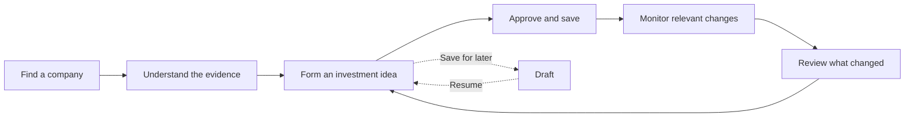

# Investment companion UX and user journey

Proposed experience, 1 October 2026. This develops the [product plan](product-and-launch-plan.md) into screens and interactions. It is a design to test, not a record of observed user behaviour or an implemented interface.

**Help the user move from an investment question to an evidence-backed idea, then make it easy to review what changes.** The first visit is guided research. The return visit is a focused review of developments affecting saved ideas. Deus and Kestrel appear as one product to the user.

## Navigation and language

Use three main destinations: **Research**, **My ideas**, and **Updates**. Put account and notification settings in the account menu. On mobile, use the same three destinations in bottom navigation.

Research is the starting point for a new user. Once the user has saved ideas, the default home is My ideas, with items needing review at the top and a link to all updates. A notification opens its specific change directly and preserves that destination through sign-in.

Use “investment idea” in the main interface and explain “thesis” as an optional term. Ask “What would change your mind?” rather than requiring the user to understand invalidation conditions. Existing Kestrel proposals become contextual suggestions within an idea; users do not have to learn an agent-management workflow. Explain metrics where they appear, with detailed definitions available on demand.

## Journey map

The thoughts and friction below are design hypotheses to check in interviews.

| Stage | User question and likely friction | Experience and primary action | Successful outcome |
| --- | --- | --- | --- |
| Arrive | “Can this help with the company I am considering?” Unclear value or sign-up fatigue | Search for a supported company or open a labelled sample; **Explore company** | Recognises a relevant research task |
| Understand | “What matters here?” Overwhelmed by news, ratios and competing stories | Short brief covering business performance, expectations, supporting evidence and risks; **Inspect evidence** | Can explain a key argument and one uncertainty |
| Form an idea | “What do I actually believe?” Difficulty translating a story into something testable | Plain-language idea editor with suggested conditions and contrary evidence; **Review my idea** | Has an explicit reason and knows what could change it |
| Save and monitor | “What will the app watch?” Concern about effort or noisy alerts | Review the idea and each condition; authenticate if needed, then save; choose optional notifications | Approved idea with clear monitoring scope |
| Return after a change | “Does this affect my reasoning?” Headline anxiety or lack of context | A before/after comparison linked to the affected condition and sources; **Review change** | Understands the relevance and uncertainty |
| Reassess | “Keep, change, or stop following this idea?” Fear of losing the original reasoning | Keep, edit, leave unresolved or archive; preserve history; **Save review** | Deliberate review without pressure to trade |

Saving a draft is a valid stopping point. It is clearly labelled as not monitored until the user approves a usable set of conditions. The product should also support concluding that an idea is unconvincing; it does not need to convert every research session into a monitored thesis.

## First visit

### Research entry

Lead with “What company are you looking into?” and one search field. Offer a clearly labelled recorded sample for someone without a company in mind. The sample can demonstrate value before sign-up without requiring live research calls. Authenticate before saving private work and respect data-access requirements for actual research.

After company selection, optionally ask “What are you trying to understand?” Offer task prompts such as understanding the business, checking an investment story, or looking for risks. Do not require a salary, CPF balance, bank connection, risk quiz or course completion.

### Company brief

Open with a short overview, an as-of time and coverage status. Show four questions in a consistent order:

1. **How is the business performing?** The few fundamentals relevant to this company, with comparable periods and explanations.
2. **What expectations are people discussing?** Separate management statements, entitled consensus data, social narratives and interpretation.
3. **What supports the idea?** Evidence tied to specific claims.
4. **What could undermine it?** Contrary evidence, unresolved questions and relevant risks.

The summary is immediately readable. Opening a claim reveals the source, date, quotation or metric, and why it supports or challenges that claim. Keep source statements distinct from generated interpretation. Show additional ratios and methodology only when requested.

Keep an “Ask about this” action near the relevant content, with suggestions such as “Explain this metric” or “What evidence challenges this claim?” Research chat supplements the structured brief; users can complete the main journey without knowing how to write an effective prompt.

The main next action is **Build my investment idea**. A secondary **Save for later** action preserves a draft. Do not present a generated buy/sell verdict or use a confidence percentage as an investment-success score.

### Idea editor

Use three plain-language prompts: **Why am I interested? What needs to happen? What would change my mind?** Offer an optional horizon. The user can write directly or review suggested text from the research brief.

Translate proposed monitoring conditions into readable sentences. Let the user inspect and edit the metric, threshold, period, event scope and deadline. Any suggested number must be identified as a proposed assumption with its rationale; it is not silently selected as a recommendation. For an event, show the evidence that would count as confirmation.

Keep suggestions unselected until reviewed, or require an explicit review step for the whole proposed set. A condition being met means only that the user's stated condition is met. Supporting conditions and adverse events need distinct labels and explanations.

Finish with one summary showing the idea, its conditions, unknowns and monitoring scope. **Save and monitor** commits the approved version. Notification preferences follow, with an easy skip; saving an idea must not enrol the user into every channel.

### Monitoring setup

Explain which sources and metrics are covered and when checks occur. Offer the channels actually available, with weekly summaries and optional material-change alerts. An in-app-only choice remains useful. Do not promise live coverage when acquisition is periodic.

After saving, show the idea and its current condition results. The first meaningful outcome is “I understand what I am following and why,” not a trade, broker referral or completed lesson.

## Returning user

### My ideas

Lead with changes needing review. Each idea shows its title/company, the user's one-sentence reasoning, the relevant change, last review time, and separate coverage status. A quiet idea can say **No material change detected within covered sources**. A failed source check must not receive the same message.

Avoid treating favourable conditions as a green investment rating. Suggested display labels include **New evidence to review**, **Condition met**, **Risk condition triggered**, **Conflicting evidence**, and **Data unavailable**. Review status and condition status are separate: a user can review a risk without making it disappear.

### Change review

Open the exact condition affected by an update. The screen answers four questions: **What changed? What did I previously believe? Why might this matter? What evidence can I inspect?** Show the previous and current observations, their reporting periods, sources and remaining uncertainty.

For a fictional example, an alert might read: “The latest result is below the revenue-growth threshold you set. Review the filing and your investment idea.” Another condition may still be met. The screen should preserve that mixed picture instead of replacing it with one buy/sell score.

Let the user choose **Keep my idea**, **Edit my idea**, **Need more information**, or **Archive**. A note can be optional. Keeping an idea marks the update reviewed without altering the evidence or condition result. Editing shows the changes before saving a new version. History remains accessible from the same screen.

Generated suggestions appear alongside the change, with a proposed before/after edit and supporting evidence. Accept, edit or reject them explicitly. If the user has already changed the idea, a stale suggestion needs review against the current version before it can be applied.

## Important alternate states

| Situation | UX response |
| --- | --- |
| No company in mind | Offer a labelled sample and a guided research question; no list implying recommended stocks |
| Research is loading | Show available cached information with its date and honest progress/status; preserve the user's input |
| Company or metric is unsupported | State the coverage limit and allow another company or a saved draft |
| Sources disagree | Show the disagreement and its provenance; allow an unresolved review |
| Evidence is missing or stale | Display unknown/stale coverage beside the relevant condition; never turn missing data into a favourable result |
| Nothing material changed | Provide a quiet review state within stated coverage; do not invent urgency |
| Edit conflicts with a newer version | Preserve the user's work and show the differences before resubmission |
| Notifications become noisy | Make cadence, pause and channel settings easy to reach from the notification |
| Usage limit is reached | Explain the specific limit and available options; retain source access for the result already shown |

## Relationship to the existing products

| Experience | Reuse | Design work |
| --- | --- | --- |
| Research entry and company brief | Deus acquisition, summaries and research logic | Focused company research screen and evidence presentation |
| My ideas and idea editor | Latest Kestrel dashboard, cards and thesis editor | Plain-language prompts, progressive detail and clear monitoring scope |
| Change review and history | Kestrel evidence panels and evaluation timeline | Version-correct before/after results and coverage states |
| Contextual suggestions | Kestrel proposal functions | Present changes beside the affected idea rather than as a required separate workflow |
| Notifications | Kestrel notification UI and available delivery services | Digest preferences, direct links and meaningful-change grouping |

Keep the latest frontend as the implementation reference. These changes concern navigation, copy and workflow around reusable screens, not a requirement to discard its components. The database design's proposed preferences and user-review events support this experience; they are not implemented by this UX document.

## Usability checks

Use a fictional company example containing supporting evidence, an adverse development, and missing data. Ask a new participant to understand the idea, inspect its sources, define what would change their mind, save it, then review a later update. These are proposed checks, not completed research.

Observe whether participants distinguish a reported fact from an expectation; can explain why a source matters; understand that a met condition is not a buy recommendation; find missing coverage; and revise their idea without losing its history. Record time to first useful result, task failures and requests for help. The earlier five-minute onboarding target remains a hypothesis to test.

Test with both novice students and first-jobbers, including people who do not know the founders. Verify keyboard and phone use, labelled controls, readable text and states that do not rely on colour alone. Do not judge success by whether the participant trades or agrees with the generated research.
