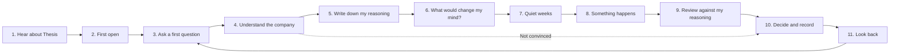

# Companion user journey for students and new investors

Journey and first implementation, 9 October 2026. It describes how Thesis should feel as a research companion for students and new investors. Except for the implemented slice below, it is a design to test with participants, not observed behaviour. Each step is tagged:

- **Exists** — available in the current app, possibly under a different name.
- **Change** — exists but needs simpler wording, order or defaults for beginners.
- **New** — not built yet.

The one-sentence promise: **Thesis helps you explore an investment idea, keep your reasoning, and review changes in the evidence you follow.**

The companion helps the user form and revisit a view. It does not issue a buy/sell verdict. Monitoring remains opt-in, bounded by actual source coverage and the app's running state; the promise must not imply exhaustive or continuous detection.

## Judgment of the proposal

The reasoning-to-review loop is the right product direction. Prefer new investors with a few existing holdings as the first recruitment hypothesis, with university investment clubs as one channel. Do not assume club membership establishes demand, comprehension, willingness to pay or the needs of all new investors. Include people who decide not to invest.

Revise the competitive claims. “None of them offer this” is not established, and Simply Wall St already describes a [Narratives framework for building, tracking and evolving an investment thesis](https://simplywall.st/). Avoid the blanket claim that ChatGPT forgets reasoning and the generalization that every finance app pushes trading. Test a narrower distinction: exact dated evidence tied to a private question, the user's original words, approved conditions and an inspectable review history. These properties are a product proposition, not a validated moat.

Do **not** collapse independent limitations into one confidence score or green “safe” indicator. Access restrictions, stale/earlier-method readings, incomplete coverage, missing figures and disagreement mean different things and can coexist. A future **Evidence status** entry may group details, but consequential limitations must remain beside the affected claim. The current slice preserves existing warnings and withholding.

Plain-language worries should become reviewable drafts only when they map to the supported numerical/event vocabulary. Never invent a threshold, observation window, outcome or an investment recommendation. Open-ended concerns such as a customer leaving may remain a research question. “I cannot define this yet” stays a valid draft outcome.

The three-part alert pattern is useful for alerts with an actual saved-idea connection. Company-only updates must not invent why an event matters to a user's idea or borrow a current revision when the alert used an older one. A look-back should quote original dated reasoning and recorded decisions, including unresolved evidence; it cannot infer correctness or a decision to invest from an acknowledgement.

The Singapore review is a real launch item: the [Financial Advisers Act's Second Schedule](https://sso.agc.gov.sg/Act/FAA2001?Phrase=electronic&ProvIds=Sc2-&ViewType=Advance&WiAl=1) includes advice through research analyses/reports. A qualified Singapore adviser should assess the actual service, wording and applicable exemptions; this product review is not a licensing conclusion. No public launch or participant recruitment is performed here.

Keep shared company research and explicit paid private actions. A single US$0.70 research run is a measured example, not per-user unit economics: evaluate cache reuse, refresh frequency, private checks, data fees and support. This first companion slice adds no model or acquisition stage and does not alter the existing paid blocker or allowance.

## Implemented first slice

- **Ask a question** opens **Your research**, where **Start with a question** opens four optional reading shortcuts. Business and risks lead to their exact Overview topics (or the missing/withheld state); growth opens Financials; expectations opens Outlook. The fictional sample omits the unsupported Outlook shortcut and identifies its recorded scenario. This shares the existing research entry. There is no compulsory modal on page load, new fixed warning strip or onboarding completion score.
- A selected shortcut shows a temporary question and reading prompt only in its relevant section. **Close guide** removes it. It resets when changing company/account, without storing private drafts in browser preferences. Reading shortcuts do not save a library selection, request an AI answer, refresh a provider or enable a watch. Existing first-company source loading remains a separate, unchanged behaviour.
- **Ask my own question** opens the existing private question interface. The same four plain questions are also choices in its existing library selector; selecting there retains its explicit save behaviour. Existing defaults, selections, answers and historical questions are preserved.
- **Save my reasoning** opens the original editor. With a new idea, the selected starter fills the question only; reasoning remains empty. With a saved idea, its exact question and reasoning remain intact. The sentence template and brief help invite one reason and one uncertainty, including a decision not to invest. They are hints, never saved user words. Draft/approval/conflict/cancel behaviour is unchanged.
- Short explanations for revenue, growth, operating margin, free cash flow, P/E, guidance, analyst consensus and GAAP/adjusted figures sit beside relevant figures/labels. Each `?` is a labelled 44px button opening the existing native dialog, with Escape, focus return and phone layout support. Definitions explain the measure and what to check; they add no company-specific factual interpretation.
- The empty workspace uses the single-sentence promise and invites a company the user owns or wants to understand. It does not require holdings, financial details or a new sign-in policy.

Still proposed: broad evidence-status presentation, worry-to-condition suggestions, revised private-alert/weekly-review narrative, explicit decision notes, look-back view and participant measurement. Do not describe these as shipped by this slice. See [verification](../reviews/2026-10-09/companion-start.md).

## Who we are designing for

**Mei, 21, second-year student.** She opened a brokerage account six months ago and holds small positions in three companies she knows as a consumer. She is in her university investment club. She reads headlines on her phone, sometimes on Reddit, and feels anxious when a stock drops without knowing whether it matters.

- **Wants:** to understand what she owns, to have a reason she can explain, and to know when something important happens.
- **Doesn't want:** a course, a risk quiz, a buy/sell score or another app that pushes her to trade.
- **Struggles with:** jargon (margin, free cash flow, consensus), too many headlines, and not knowing which news is about the company versus about the market.

A second path covers **Daniel, 19**, who owns no stocks yet and is preparing a stock pitch for his club. His success is a clear, sourced argument, which may end in "I wouldn't invest".

## Journey at a glance

Stopping after step 4 or step 5 is a valid outcome. Deciding not to invest is a successful research result, not a drop-off.

## Stage by stage

### 1. Hear about Thesis

| | |
| --- | --- |
| Mei's goal | "Is this another stock-tip app?" |
| Where | Investment club session, a friend's shared research link, a short demo |
| What she should hear | "Keep track of *why* you own something, and get told when it actually matters." |
| Risk | Thinking it gives recommendations, or that it is a course |
| Success signal | She opens it with a company she already owns in mind |

**New:** a one-line landing message and a club-friendly demo using a real company. Avoid performance claims, returns or "find winners" language.

### 2. First open

| | |
| --- | --- |
| Mei's goal | Get to something useful within a minute |
| She sees | "What company are you looking into?" with one search field, plus a few familiar suggestions |
| She does | Searches for a company she owns |
| Risk | Empty workspace, sign-in friction, being asked for financial details |
| Success signal | A company page loads with an explanation of what she is looking at |

- **Exists:** company search across the SEC directory; first open loads sources automatically.
- **Change:** the empty workspace should lead with the search and familiar examples rather than an empty layout.
- **New:** no risk quiz, salary or account-linking step. Only ask for sign-in when she saves something private.

### 3. Ask a first question

| | |
| --- | --- |
| Mei's goal | "I don't know what to look at." |
| She sees | Four starter questions: *How does this company make money? Is it growing? What could go wrong? What do analysts and management expect?* |
| She does | Picks one, or writes her own |
| Risk | Facing five tabs with no starting point |
| Success signal | She chooses a question and the page points her to the right section |

- **Exists:** the private research question library and explicit answers from news, social posts and filings.
- **Implemented:** optional starter questions linked to existing saved research. A shortcut supplies a starting point, not a guarantee that the saved material answers it.

### 4. Understand the company

| | |
| --- | --- |
| Mei's goal | Explain the business in her own words |
| She sees | Overview summary sentences and section cards; revenue and expenses flow; headlines before sentiment |
| She does | Reads the summary, hovers on unfamiliar terms, opens evidence for one claim |
| Risk | Jargon, too many caveats, assuming a price move was caused by a headline |
| Success signal | She can say how the company makes money and name one uncertainty |

- **Exists:** Overview snapshot, Financials reading, News & discussion, Outlook, evidence dialogs with exact sources.
- **Proposed with revision:** a plain **Evidence status** entry can group explanations, preserving distinct limitations and consequential notices beside affected claims; no aggregate confidence score.
- **Implemented first slice:** short tap/keyboard explanations beside common terms, with a definition and what to check. No unsupported “why this matters for this company” is generated.

### 5. Write down my reasoning

| | |
| --- | --- |
| Mei's goal | "Why do I actually own this?" |
| She sees | My research: question, idea, monitoring, decision |
| She does | Writes two or three sentences; Thesis offers a template: *I think ___ because ___. I'm unsure about ___.* |
| Risk | Blank-page anxiety; feeling she must sound like an analyst |
| Success signal | A saved idea in her own words, even if rough |

- **Exists:** the idea editor, drafts, revisions and history.
- **Implemented:** sentence-template placeholder and drafting help; reasoning stays empty until the user writes it. Saving a draft requires no condition.

### 6. What would change my mind?

| | |
| --- | --- |
| Mei's goal | Know what to watch without learning threshold rules |
| She sees | "What would worry you?" with examples: *sales stop growing*, *margins fall*, *a key customer leaves*, *management lowers guidance* |
| She does | Picks one or two; Thesis suggests a matching condition and explains it in plain words before she approves |
| Risk | Being asked for "operating margin < X%" before she knows what a normal margin is |
| Success signal | One approved condition she can explain, or a deliberate "I can't define this yet" |

- **Exists:** numerical required/risk conditions, event conditions with report windows, reviewable suggestions, explicit approval.
- **New:** a "What would worry you?" step that turns a plain-language worry into a suggested condition, showing the company's recent figures as context for the threshold.
- **Change:** watch settings should show *what will be checked* and *how often*, not internal options.

### 7. Quiet weeks

| | |
| --- | --- |
| Mei's goal | Not have to check every day |
| She gets | A weekly review: what was checked, nothing important changed, what is still unresolved |
| Risk | Silence feels like the app stopped working; or too many low-value alerts |
| Success signal | She distinguishes a completed quiet check from an outage, missing coverage or no check |

- **Exists:** scheduled weekly reviews, watch check history, Telegram alerts.
- **Change:** weekly review copy should read as "Your research this week", leading with her ideas, then any changes, then what was checked.

### 8. Something happens

| | |
| --- | --- |
| Moment | Earnings release, guidance change or a burst of discussion |
| Mei's feeling | Anxious; the stock moved and headlines disagree |
| She gets | One grouped update, not a stream of headlines |
| Risk | Alarmist alerts; implying the news caused the price move |
| Success signal | She opens the update rather than the broker app |

- **Exists:** company and saved-reasoning alerts, condition changes, the Updates inbox, Telegram delivery.
- **Change:** alert wording in three parts: **What changed → Why it matters for your idea → What to check.** Lead with her saved sentence.

### 9. Review against my reasoning

| | |
| --- | --- |
| Mei's goal | "Does this break my reason for owning it?" |
| She sees | Her original reasoning beside the new evidence, the condition before and after, and what is still unknown |
| She does | Opens one source, reads the exact quotation |
| Risk | Mixed evidence feels like no answer |
| Success signal | She can say whether her reason still holds, partly holds or no longer holds |

- **Exists:** before/after comparisons, exact source evidence, private comparisons.
- **Change:** show "partly supports / partly challenges" as a normal result, not an error state.

### 10. Decide and record

| | |
| --- | --- |
| Mei's goal | Close the loop without pressure to trade |
| Options | Still holds · Update my reasoning · Leave unresolved · Stop following |
| Risk | Thinking "Mark reviewed" means "this is safe" |
| Success signal | A recorded decision, with a short note on why |

- **Exists:** append-only review acknowledgement, edits as new revisions, archive, history.
- **New:** an optional one-line "Why I decided this" note attached to the decision.

### 11. Look back

| | |
| --- | --- |
| Mei's goal | Learn from her own reasoning |
| She sees | "On 9 Oct you thought X because Y. Since then: …" for each idea, with what turned out right, wrong or still unknown |
| Risk | Turning into a scorecard of returns |
| Success signal | She edits an old idea or starts a better-framed new question |

- **Exists:** immutable revision history and exports.
- **New:** a look-back view built from saved revisions and recorded decisions. Compare reasoning with evidence, not with profit.

## Daniel's path: preparing a club pitch

1. Searches a company he has never owned and picks **"What could go wrong?"**
2. Reads Overview, Compare & value (peers, analyst targets) and Outlook.
3. Writes a draft idea and a counter-argument.
4. Exports a sourced research record to share with the club. **Exists:** review export. **New:** a pitch-friendly summary layout.
5. Concludes "interesting business, too expensive for me right now" and records that decision. Thesis treats this as a completed piece of research.

## Moments that build or break trust

| Builds trust | Breaks trust |
| --- | --- |
| Every claim opens its original source | A summary that sounds certain but has no source |
| "Nothing changed, and here is what we checked" | Silence with no sign the app looked |
| Plain uncertainty: "We don't have this figure" | Many unexplained warning labels |
| Her own words shown back to her | Generic market commentary |
| One grouped update per event | A stream of near-duplicate alerts |
| Encouraging tone, no rush | Price-move framing, "you missed", streaks |

## Things this journey deliberately excludes

Buy/hold/sell verdicts, investment scores, top-pick lists, trade execution, leaderboards, return-based gamification, mandatory courses and personal-finance planning. Before inviting real users, check how the intended wording is treated under Singapore's financial advisory rules; a disclaimer alone does not settle that.

## How to tell the journey works

Measure each stage separately, and include people who stop early.

| Stage | Signal |
| --- | --- |
| First open → question | Chose or wrote a question in the first session |
| Understand | Can explain how the company makes money and one uncertainty, unprompted |
| Reasoning | Saved an idea in their own words (draft counts) |
| Change my mind | Approved one condition they can explain, or chose "can't define yet" |
| Something happens | Opened the update within a few days of a relevant event |
| Review and decide | Recorded a decision; edits and "stop following" count as success |
| Look back | Revisited or revised an older idea |

Do not use time in app, number of alerts opened or trading activity as success measures.

## Suggested build order

1. Starter questions linked to tabs (step 3).
2. Term explanations (implemented) and a separate design for evidence status that preserves independent limitations (step 4).
3. Reasoning template and "What would worry you?" condition step (steps 5–6).
4. Three-part alert wording and weekly review copy (steps 7–8).
5. Decision note and look-back view (steps 10–11).

Test steps 1–4 with five to eight participants before building the look-back view.

For the next participant test, use a prepared permitted research sample: “Find out how this company makes money and save one reason you would worry.” First observe unassisted behaviour, then ask the participant to explain the business, one uncertainty, and the difference between a forecast and a reported figure. Record task completion, help needed and misconceptions, including those who stop. Later, measure return following a genuinely relevant, independently reviewed event and explicit reasoning edits/decisions; an alert open or acknowledgement alone is not comprehension. Use a frozen before/after sample and baseline notes workflow for comparison, and report the small sample without generalizing retention. Wednesday 7 October is an earlier test date, not an upcoming session as of this document. No analytics or participant data collection is added by this implementation.
